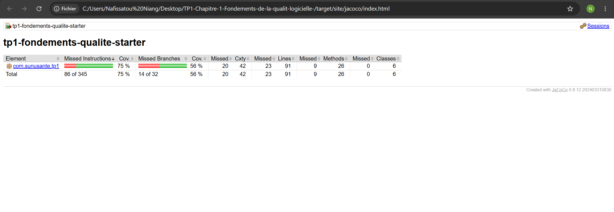

# SunuSanté - TP1 : Fondements de la qualité (Java)

## Contexte

Vous rejoignez l'équipe technique de **SunuSanté**, une clinique qui veut
digitaliser la prise de rendez-vous. Un collègue parti en urgence vous laisse
`GestionRendezVous.java` : ça compile, les tests fournis passent, la
fonctionnalité marche. Votre mission n'est pas de tout réécrire, mais de
la faire évoluer **sans la casser**, en appliquant ce que vous avez vu au
chapitre 1.

## Prérequis techniques

- JDK 17 ou plus (vérifiez avec `java -version`)
- Maven (vérifiez avec `mvn -version`)

Pour lancer les tests :

```bash
mvn test
```

Pour générer le rapport de couverture (après `mvn test`) :

```
target/site/jacoco/index.html
```

## Étape 1 - Observer avant de juger

Lancez `mvn test`. Tout est vert. Répondez dans votre rapport : ce résultat
vous dit-il quelque chose sur la **qualité interne** du code ? Pourquoi ?

Le fait que tous les tests passent montre que les fonctionnalités actuellement
testées fonctionnent correctement (qualité externe). En revanche, cela ne garantit
pas la qualité interne du code. Le code peut contenir de la duplication, être difficile
à maintenir ou ne pas respecter les principes de conception. Des tests verts signifient
seulement que les comportements testés sont corrects, pas que le code est bien conçu.

## Étape 2 - Mesurer la complexité cyclomatique

À la main, sur `ajouterRendezVous` et `calculerTotalFacture`, comptez le
nombre de décisions (`if`, `else if`, `&&`, `||`) et appliquez la formule du
cours : `complexité = nombre de décisions + 1`. Situez le résultat sur la
grille de lecture du risque (1–10 simple, 11–20 modérée, 21–50 complexe,
> 50 candidat au refactoring). Notez vos chiffres dans le rapport.

Méthode         	   Nombre de décisions	    Complexité	   Niveau
ajouterRendezVous	   16	                    17	           Modérée
calculerTotalFacture   13	                    14	           Modérée

## Étape 3 - TDD : ajouter le tarif dégressif

**Règle métier à implémenter** : à partir du 2e rendez-vous d'un même
patient pris à la **même date**, ce rendez-vous (et les suivants ce jour-là)
bénéficie d'une réduction de 15 % sur son tarif déjà calculé (après
majoration weekend et réduction VIP éventuelles).

Respectez strictement le cycle vu en cours :

1. **RED** - ajoutez un test dans `GestionRendezVousTest` qui décrit cette
   règle et vérifiez qu'il échoue.

on commence par écrire un test qui décrit une nouvelle règle métier attendue, 
sans encore modifier le code de l'application. Dans notre cas, le test tarifDegressif 
vérifie que le deuxième rendez-vous d'un même patient à la même date bénéficie d'une 
réduction de 15 %. Le test échoue car cette fonctionnalité n'existe pas encore dans 
la couche métier (GestionRendezVous.java) : la méthode ajouterRendezVous() calcule 
uniquement le tarif de base, la majoration du week-end et la réduction VIP, mais ne 
prend pas en compte la réduction dégressive. Cet échec est donc volontaire et confirme 
que le test détecte bien l'absence de la nouvelle règle. 

2. **GREEN** - écrivez le code le plus simple possible dans
   `GestionRendezVous` pour faire passer ce test, sans casser les tests
   existants.


Ensuite, pendant la phase GREEN,on ajoute la logique nécessaire dans la
couche métier pour appliquer la réduction de 15 %,ce qui permet au test
de réussir.

3. **REFACTOR** - maintenant que vous avez un filet de tests complet,
   nettoyez. C'est le moment de repérer la duplication entre
   `ajouterRendezVous` et `calculerTotalFacture` : la logique de tarif y est
   recopiée quasiment à l'identique.

Dans cette étape, nous avons identifié une duplication de la logique de 
calcul du tarif présente dans les méthodes ajouterRendezVous() et 
calculerTotalFacture(). Pour respecter le principe DRY (Don't Repeat Yourself), 
on a extrait cette logique dans une méthode unique appelée calculerPrix(), 
responsable du calcul du tarif de base, de la majoration du week-end et 
de la réduction VIP. Les deux méthodes utilisent désormais cette fonction 
commune, ce qui évite la répétition du code et facilite les futures 
évolutions des règles tarifaires. La réduction dégressive de 15 % reste 
dans ajouterRendezVous() car elle dépend du contexte du patient et du 
nombre de rendez-vous déjà enregistrés. Après cette modification, 
les tests restent verts, ce qui confirme que le comportement de l'application 
n'a pas changé malgré l'amélioration de la qualité interne du code.

Faites un commit Git séparé à chaque étape (RED, GREEN, REFACTOR) : c'est ce
qui sera vérifié.

## Étape 4 - Refactoring vers une architecture propre

Poursuivez le refactoring jusqu'à obtenir une classe par responsabilité :

- Le **type** de consultation et son tarif de base (SRP : une seule raison
  de changer si un tarif évolue)
- Le **calcul du tarif** (toutes les règles : weekend, VIP, dégressif) dans
  une seule classe, pour éliminer la duplication (DRY)
- Le **stockage** des rendez-vous, séparé de la logique métier
- L'**orchestration** (validation + calcul + stockage), séparée de
  l'affichage

Dans cette étape de refactoring, on a restructuré le code afin de respecter 
le principe de responsabilité unique (SRP) et d'améliorer la maintenabilité de 
l'application. On a séparé le type de consultation et son tarif de base dans la 
classe `TypeConsultation`, ce qui permet de modifier un tarif sans impacter les 
autres parties du système. La logique de calcul du prix, comprenant la majoration 
du weekend, la réduction VIP et la réduction dégressive, a été déplacée dans la 
classe `CalculateurTarif` afin de supprimer la duplication du code et de respecter 
le principe DRY (Don't Repeat Yourself). La gestion de la liste des rendez-vous a 
été isolée dans la classe `StockageRendezVous`, qui est uniquement responsable de 
l'ajout, de la suppression et de la recherche des rendez-vous. Enfin, la classe 
`GestionRendezVous` a été conservée comme classe d'orchestration : elle assure la 
validation des données, coordonne le calcul du tarif et l'enregistrement des 
rendez-vous, tandis que l'affichage a été déplacé dans une classe dédiée 
`AfficheurRendezVous`. Cette nouvelle organisation permet d'obtenir un code plus clair, 
plus facile à faire évoluer et qui respecte les principes de conception vus dans le cours.


## Étape 5 - Couverture de code

Relancez `mvn test` et ouvrez `target/site/jacoco/index.html`. Visez au
moins 70–80 % sur vos classes de logique métier. Une classe à 0 % est-elle
forcément un problème ? Justifiez dans le rapport (indice : relisez la
nuance du chapitre 1 sur la couverture).



Après l'exécution de mvn test, le rapport JaCoCo montre une couverture globale de 75 % 
des instructions, ce qui respecte l'objectif fixé entre 70 et 80 %. La couverture des 
lignes est satisfaisante avec 91 lignes couvertes. La couverture des branches est plus 
faible (56 %) car certains chemins conditionnels comme les cas d'erreur ou certaines 
règles métier particulières ne sont pas tous testés. Cependant, une couverture de code 
élevée ne garantit pas l'absence de défauts : elle indique seulement quelles parties 
du code ont été exécutées pendant les tests. Une classe avec 0 % de couverture n'est 
pas forcément un problème si elle contient uniquement des éléments difficiles à tester 
directement (par exemple une classe de données ou une classe responsable uniquement du 
stockage). L'objectif est de vérifier que les parties critiques contenant la logique 
métier sont correctement testées.


## Étape 6 - Rapport qualité

Complétez `RAPPORT_TEMPLATE.md` et rendez-le avec votre dépôt Git.

## Rappel de repère de dates

Dans vos tests, `2026-07-21` est un **mardi** (semaine) et `2026-07-25` est
un **samedi** (weekend).
